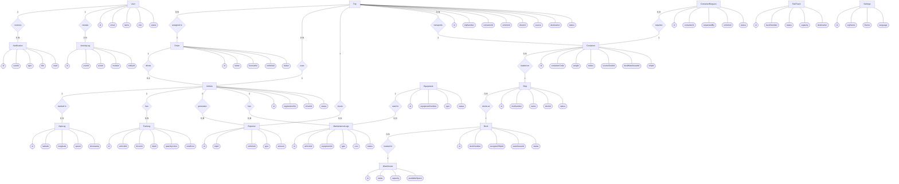

# Vadhvan Port Management - ER Diagram (Chen Notation)

```mermaid
flowchart TD
    %% Entities
    User[User]
    Notification[Notification]
    ActivityLog[ActivityLog]
    Driver[Driver]
    Vehicle[Vehicle]
    Trip[Trip]
    FuelLog[FuelLog]
    Expense[Expense]
    MaintenanceLogs[MaintenanceLogs]
    Container[Container]
    ContainerRequest[ContainerRequest]
    Ship[Ship]
    Dock[Dock]
    Warehouse[Warehouse]
    Equipment[Equipment]
    GpsLog[GpsLog]
    RailTrack[RailTrack]
    Settings[Settings]

    %% Relationships
    receives{receives}
    creates{creates}
    drives{drives}
    has_fuel{has}
    generates_exp{generates}
    has_maint{has}
    tracked_in_gps{tracked in}
    assigned_to_driver{assigned to}
    uses_veh{uses}
    transports_cont{transports}
    requires_cont{requires}
    loaded_on{loaded on}
    docks_at{docks at}
    located_in{located in}
    incurs_exp{incurs}
    used_in{used in}

    %% Connect Entities through Relationships
    User ---|1| receives ---|0..N| Notification
    User ---|1| creates ---|0..N| ActivityLog
    Driver ---|1| drives ---|0..1| Vehicle
    Vehicle ---|1| tracked_in_gps ---|0..N| GpsLog
    Vehicle ---|1| has_fuel ---|0..N| FuelLog
    Vehicle ---|1| generates_exp ---|0..N| Expense
    Vehicle ---|1| has_maint ---|0..N| MaintenanceLogs
    Trip ---|0..N| assigned_to_driver ---|1| Driver
    Trip ---|0..N| uses_veh ---|1| Vehicle
    Trip ---|1| incurs_exp ---|0..N| Expense
    Trip ---|0..N| transports_cont ---|1| Container
    ContainerRequest ---|0..N| requires_cont ---|1| Container
    Container ---|0..N| loaded_on ---|1| Ship
    Ship ---|0..N| docks_at ---|1| Dock
    Dock ---|0..N| located_in ---|1| Warehouse
    Equipment ---|1| used_in ---|0..N| MaintenanceLogs

    %% Attributes for User
    u_id([id])
    u_email([email])
    u_name([name])
    u_role([role])
    u_status([status])
    User --- u_id & u_email & u_name & u_role & u_status

    %% Attributes for Notification
    n_id([id])
    n_userId([userId])
    n_type([type])
    n_title([title])
    n_read([read])
    Notification --- n_id & n_userId & n_type & n_title & n_read

    %% Attributes for ActivityLog
    al_id([id])
    al_userId([userId])
    al_action([action])
    al_module([module])
    al_entityId([entityId])
    ActivityLog --- al_id & al_userId & al_action & al_module & al_entityId

    %% Attributes for Driver
    d_id([id])
    d_name([name])
    d_license([licenseNo])
    d_vehId([vehicleId])
    d_status([status])
    Driver --- d_id & d_name & d_license & d_vehId & d_status

    %% Attributes for Vehicle
    v_id([id])
    v_reg([registrationNo])
    v_drvId([driverId])
    v_status([status])
    Vehicle --- v_id & v_reg & v_drvId & v_status

    %% Attributes for Trip
    t_id([id])
    t_tripNum([tripNumber])
    t_contId([containerId])
    t_vehId([vehicleId])
    t_drvId([driverId])
    t_src([source])
    t_dest([destination])
    t_status([status])
    Trip --- t_id & t_tripNum & t_contId & t_vehId & t_drvId & t_src & t_dest & t_status

    %% Attributes for FuelLog
    f_id([id])
    f_vehId([vehicleId])
    f_drvId([driverId])
    f_tripId([tripId])
    f_qty([quantityLitres])
    f_cost([totalCost])
    FuelLog --- f_id & f_vehId & f_drvId & f_tripId & f_qty & f_cost

    %% Attributes for Expense
    e_id([id])
    e_tripId([tripId])
    e_vehId([vehicleId])
    e_type([type])
    e_amt([amount])
    Expense --- e_id & e_tripId & e_vehId & e_type & e_amt

    %% Attributes for MaintenanceLogs
    m_id([id])
    m_vehId([vehicleId])
    m_eqId([equipmentId])
    m_type([type])
    m_cost([cost])
    m_status([status])
    MaintenanceLogs --- m_id & m_vehId & m_eqId & m_type & m_cost & m_status

    %% Attributes for Container
    c_id([id])
    c_code([containerCode])
    c_weight([weight])
    c_status([status])
    c_srcDock([sourceDockId])
    c_dstWh([destWarehouseId])
    c_shipId([shipId])
    Container --- c_id & c_code & c_weight & c_status & c_srcDock & c_dstWh & c_shipId

    %% Attributes for ContainerRequest
    cr_id([id])
    cr_contId([containerId])
    cr_reqBy([requestedBy])
    cr_vehId([vehicleId])
    cr_status([status])
    ContainerRequest --- cr_id & cr_contId & cr_reqBy & cr_vehId & cr_status

    %% Attributes for Ship
    s_id([id])
    s_imo([imoNumber])
    s_name([name])
    s_dockId([dockId])
    s_status([status])
    Ship --- s_id & s_imo & s_name & s_dockId & s_status

    %% Attributes for Dock
    dk_id([id])
    dk_num([dockNumber])
    dk_shipId([assignedShipId])
    dk_whId([warehouseId])
    dk_status([status])
    Dock --- dk_id & dk_num & dk_shipId & dk_whId & dk_status

    %% Attributes for Warehouse
    w_id([id])
    w_name([name])
    w_cap([capacity])
    w_avail([availableSpace])
    Warehouse --- w_id & w_name & w_cap & w_avail

    %% Attributes for Equipment
    eq_id([id])
    eq_num([equipmentNumber])
    eq_type([type])
    eq_status([status])
    Equipment --- eq_id & eq_num & eq_type & eq_status

    %% Attributes for GpsLog
    g_id([id])
    g_lat([latitude])
    g_lon([longitude])
    g_spd([speed])
    g_ts([timestamp])
    GpsLog --- g_id & g_lat & g_lon & g_spd & g_ts

    %% Attributes for RailTrack
    rt_id([id])
    rt_num([trackNumber])
    rt_stat([status])
    rt_cap([capacity])
    rt_dest([destination])
    RailTrack --- rt_id & rt_num & rt_stat & rt_cap & rt_dest

    %% Attributes for Settings
    st_id([id])
    st_org([orgName])
    st_theme([theme])
    st_lang([language])
    Settings --- st_id & st_org & st_theme & st_lang

```
